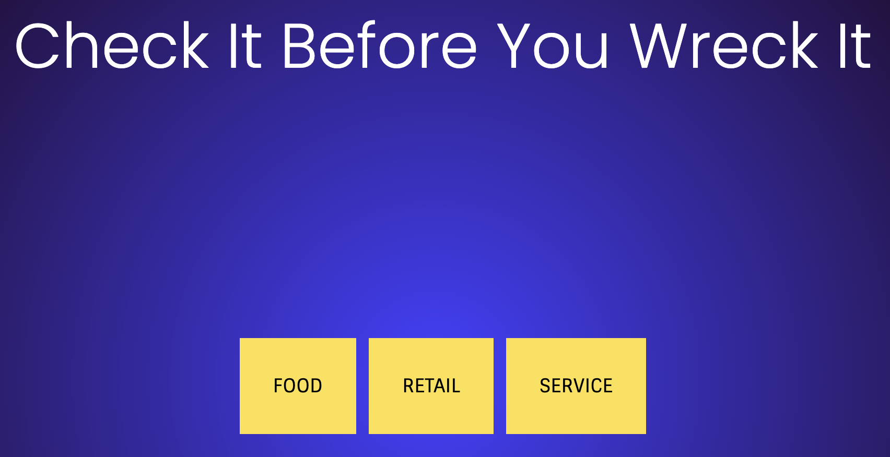

# Purchase Prequalifier Tool

[Check It Before You Wreck It](https://boisterous-alfajores-c427e6.netlify.app)

## Overview

Purchase Prequalifier Tool, a simple web application designed to help you make informed and mindful purchasing decisions. It allows you to assess potential purchases against a set of thoughtful questions to ensure the purchase aligns with your financial goals.

## Features

- Interactive questionnaire for assessing purchase decisions.
- Sequential presentation of questions and easy navigation.
- Clear recommendations based on responses.

## Getting Started

### Prerequisites

- A history of poor financial decision making.
